# Advanced CI Pipeline — Matrix Builds & Code Quality

## 📌 Project Overview
This project demonstrates a **professional Continuous Integration (CI) pipeline** using **GitHub Actions**.  
The pipeline is designed to validate code quality and reliability by running automated checks across **multiple Node.js environments in parallel**.

The focus of this project is on:
- **Configuring build matrices**
- **Integrating code quality checks**
- **Enforcing CI on push and pull requests**
- **Applying CI best practices used in real-world DevOps teams**

---

## 🎯 Objectives

### 1️⃣ Configuring Build Matrices
- Run CI jobs in **parallel** across multiple Node.js versions  
- Ensure compatibility across environments  
- Control matrix behavior using `fail-fast`

### 2️⃣ Integrating Code Quality Checks
- Automatically run **unit tests**  
- Enforce **linting rules**  
- Prevent low-quality code from being merged  

---

## 🧱 Project Structure

```text
.
├── app/
│   └── index.js
├── tests/
│   └── app.test.js
├── .github/
│   └── workflows/
│       └── ci.yml
├── .eslintrc.json
├── package.json
├── .gitignore
└── README.md
```

## ⚙️ CI Workflow Overview

The CI pipeline is implemented using GitHub Actions and is defined in:

.github/workflows/ci.yml

### 🔹 Trigger Conditions

The workflow runs automatically on:

Pushes to the main branch

Pull requests targeting main

on:
  push:
    branches: [ "main" ]
  pull_request:

### 🔁 Build Matrix Configuration

The workflow uses a matrix strategy to test the application across multiple Node.js versions.

strategy:
  fail-fast: false
  matrix:
    os: [ubuntu-latest]
    node-version: [18.x, 20.x]

Why this matters

Jobs run in parallel

All matrix jobs execute even if one fails (fail-fast: false)

Ensures consistent behavior across Node.js versions

### 🧪 Automated Quality Checks

Each matrix job performs the following steps:

Checkout repository

Set up Node.js environment

Install dependencies using npm ci

Run unit tests

Run ESLint for code quality

Generate CI job summary

- name: Install dependencies
  run: npm ci

- name: Run Tests
  run: npm test

- name: Run Linter (Code Quality)
  run: npm run lint

### 🧾 CI Job Summary

At the end of each matrix job, a summary is generated using GitHub Actions’ built-in job summary feature.

- name: CI Summary
  run: |
    echo "CI completed successfully on Node ${{ matrix.node-version }} running on ${{ matrix.os }}" >> $GITHUB_STEP_SUMMARY

## Benefits

Improves pipeline observability

Makes CI results easier to review

Demonstrates advanced GitHub Actions usage

## 🔐 Security & Best Practices

The workflow follows GitHub Actions security best practices by limiting permissions:

permissions:
  contents: read

Additional best practices used

Deterministic dependency installs (npm ci)

CI enforced on pull requests

Clear and descriptive job naming

Parallel execution using matrix builds

## 🔀 Branching & Pull Request Workflow

To simulate real-world CI usage:

Changes are made on a feature branch

A pull request is opened against main

CI runs automatically on the pull request

Only code that passes all CI checks is merged

This ensures code quality is validated before reaching the main branch.


## ✅ Outcome

This project successfully demonstrates:

Matrix-based CI pipelines

Automated testing and linting

CI enforcement on pull requests

Advanced GitHub Actions features

Industry-standard CI best practices

## 🏁 Conclusion

This CI pipeline reflects a production-ready approach to continuous integration.
<<<<<<< Updated upstream
By combining matrix builds, automated quality checks, and pull request enforcement, the workflow ensures that only reliable and high-quality code is merged into the main branch.

## Below are screenshots of workflow:
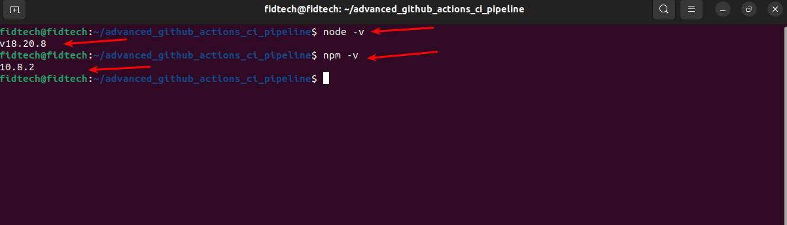
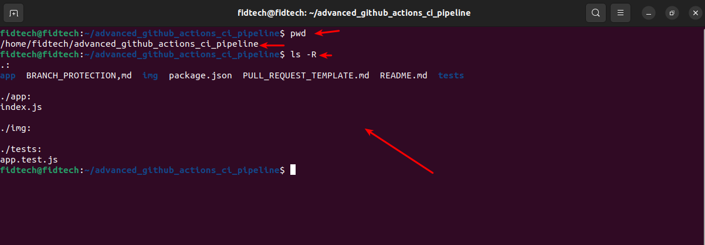
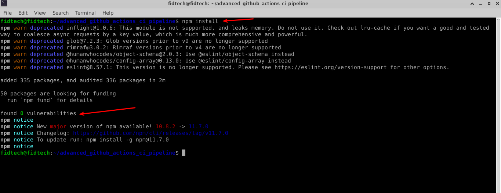
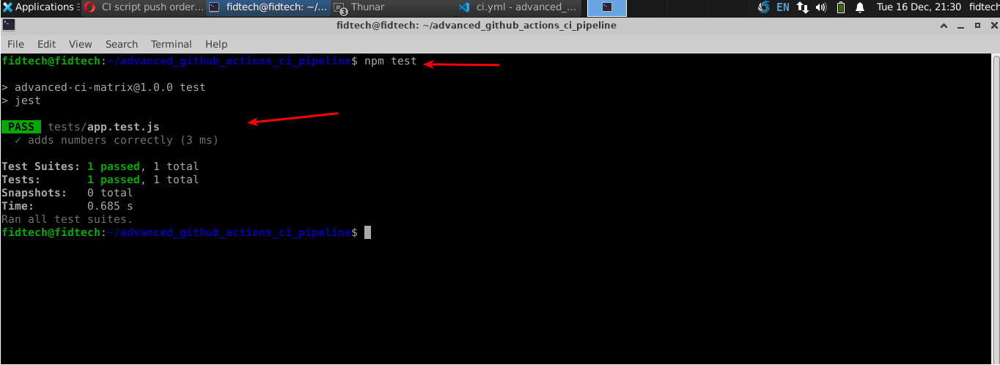
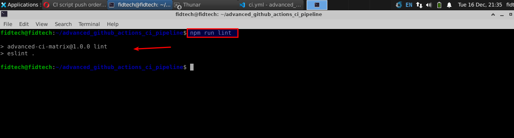
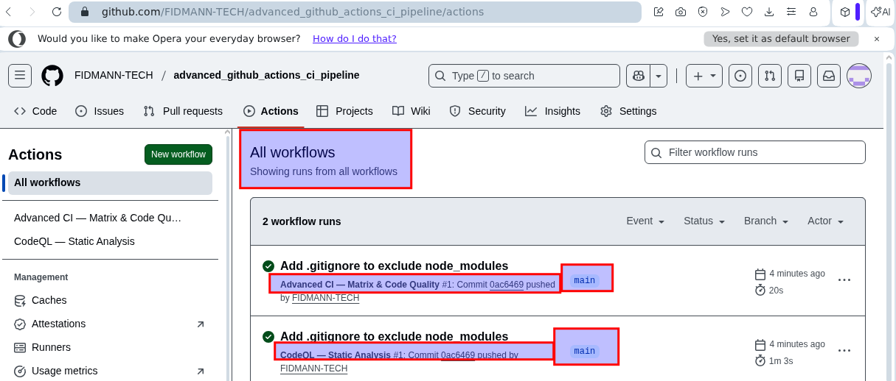
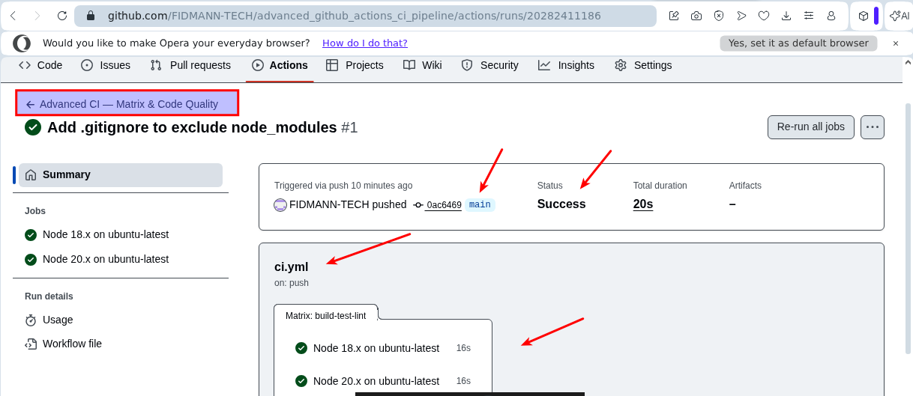
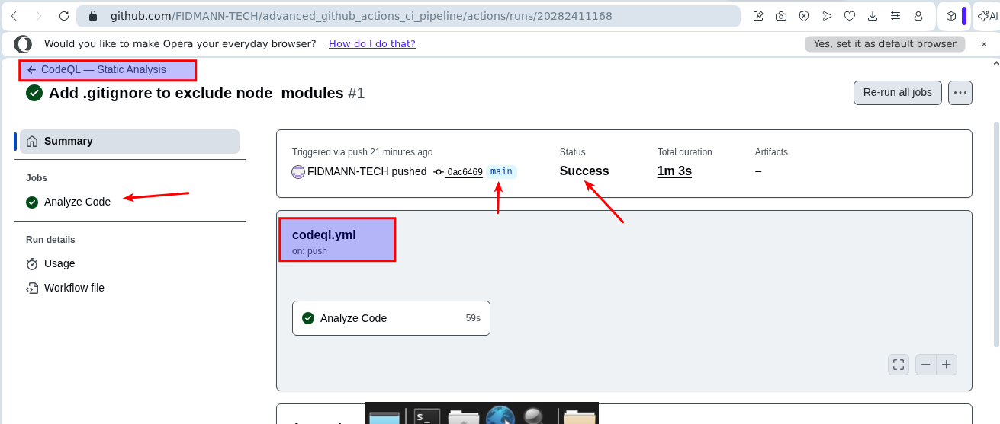
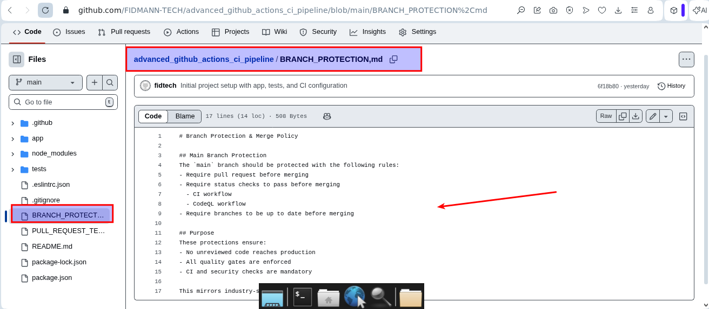
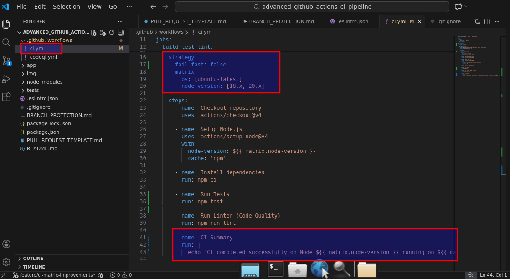
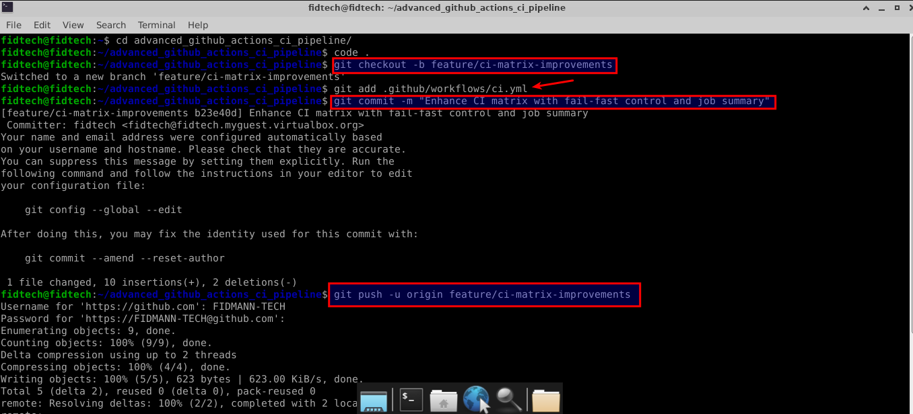
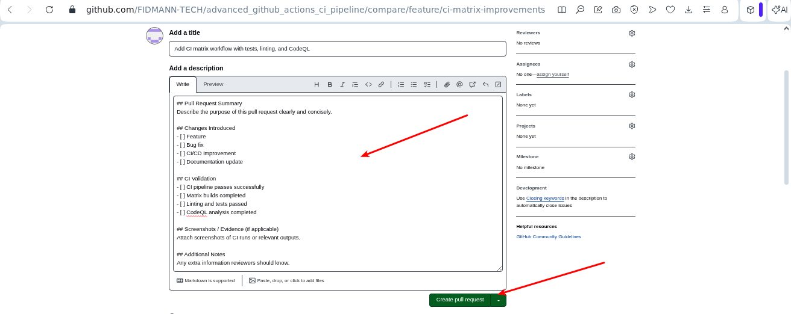
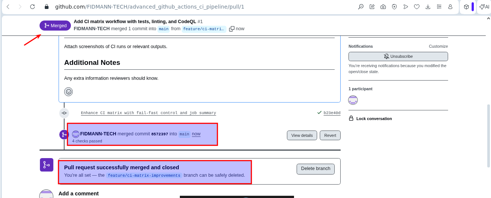
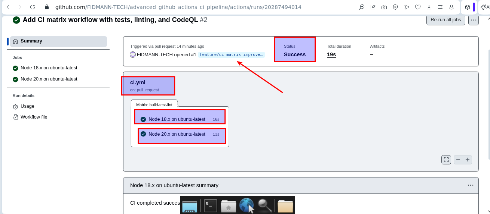
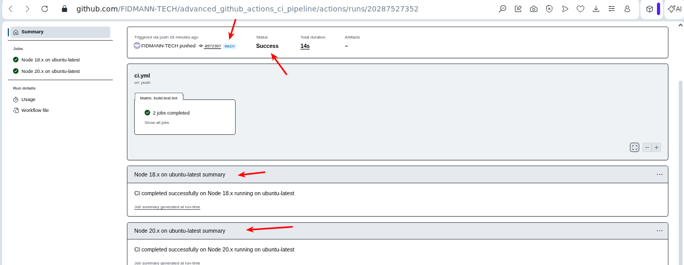
=======
By combining matrix builds, automated quality checks, and pull request enforcement, the workflow ensures that only reliable and high-quality code is merged into the main branch.
>>>>>>> Stashed changes
